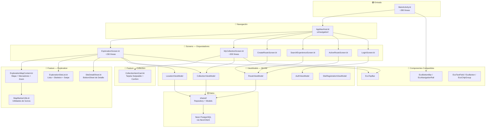

<div align="center">
  
  <h1>🌿 EcoGuia</h1>
  <p><strong>Navegación Inteligente para Turismo Cultural y Ecológico</strong></p>

  <div>
    
    
    
    
  </div>
</div>

<hr>

## 👥 Información del Proyecto
- **Nombre del Proyecto:** EcoGuia
- **Estudiantes:** 
  - Zahir Andrés Rodríguez Mora
  - Cesar Enrique Garay García
- **Grupo:** GIDS6092

## 🎯 Objetivo
Desarrollar una solución tecnológica multiplataforma (Móvil y Wear OS) que facilite la exploración de sitios de interés cultural y ecológico mediante un sistema de radar y brújula en tiempo real, permitiendo a los usuarios descubrir "Geo-Drops" y cápsulas informativas de manera discreta y eficiente.

## 🛠️ Tecnologías Utilizadas
| Área | Tecnología |
| :--- | :--- |
| **Lenguaje** | Kotlin 2.1.0 |
| **UI Framework** | Jetpack Compose (Material 3) |
| **Wear OS** | Horologist / Wear Compose Foundation |
| **Persistencia** | Room Database (Shared Module) |
| **Comunicación** | Data Layer API (Google Play Services Wearable) |
| **Arquitectura** | MVVM con módulos compartidos |

## ✨ Funcionalidades Principales

### 📱 Aplicación Móvil (Panel de Control)
- **Dashboard en Vivo:** Monitorización del estado de conexión con el reloj.
- **Control de Sensores:** Simulación de activación/desactivación de GPS y Cámara.
- **Gestión de Alertas:** Inserción y sincronización de mensajes informativos hacia la base de datos del reloj.
- **Simulador de Avance:** Control remoto del radar del reloj para pruebas de proximidad.

### ⌚ Aplicación Wear OS (Experiencia de Usuario)
- **Carrusel de Navegación (Pager):** 
  - **Modo Sigilo:** Configuración de vibración discreta para exploración silenciosa.
  - **Radar Activo:** Visualización de distancia y dirección al punto más cercano.
  - **Brújula Dinámica:** Flecha de orientación que gira en tiempo real.
  - **Resumen de Ruta:** Seguimiento del progreso de paradas visitadas.
## 👥 Roles del Sistema y Credenciales de Prueba

El sistema cuenta con un control de acceso basado en **3 roles**, donde un usuario puede acumular permisos según sus atribuciones:

| Rol | Descripción y Permisos | Autenticación Remota (Neon PostgreSQL) |
| :--- | :--- | :--- |
| **👑 Super Admin** | **Desarrolladores / Administradores de Sistema.** Acceso total a analíticas, mapa de calor, gestión de Smart TV, panel de control y todos los permisos de Moderador y Usuario. | **Auth:** Correo / Username registrado en tabla `users` con `role = 'super_admin'` |
| **🛡️ Moderador** | **Gestores Culturales.** Acceso a Alta de Sitios Históricos, Creación de Rutas Guiadas, Moderación de Comunidad (aprobar/rechazar Geo-Drops y revisar reportes) y alimentación de IA. | **Auth:** Correo / Username registrado en tabla `users` con `role = 'moderator'` |
| **🌿 Usuario Normal** | **Turistas / Visitantes.** Exploración de mapa con radar GPS, escáner de cámara AR de Geo-Drops, interacción con chatbot Miguel Hidalgo IA y Mi Colección. | **Auth:** Correo / Username registrado en tabla `users` con `role = 'visitor'` |


## 🚀 Instrucciones de Ejecución


1. **Clonar el Repositorio:**
   ```bash
   git clone https://github.com/Desarrollo-Web-Profesional-zrodriguez/Eco-Guia.git
   cd Eco-Guia
   ```

2. **Requisitos Previos:**
   - Android Studio Ladybug (o superior).
   - SDK de Android API 34+ instalado.
   - Emulador de Wear OS (preferiblemente redondo) y Emulador de Teléfono vinculado.

3. **Compilación:**
   - Abrir el proyecto en Android Studio.
   - Ejecutar el módulo `:mobile` en el teléfono.
   - Ejecutar el módulo `:wear` en el reloj.

4. **Prueba de Conectividad:**
   - Usar el botón "Vincular con Reloj" en el móvil para activar las funciones en el wearable.

## 📸 Capturas de Pantalla

<div align="center">
  <table>
    <tr>
      <td align="center"><b>Vinculación Inicial</b></td>
      <td align="center"><b>Radar Activo</b></td>
    </tr>
    <tr>
      <td></td>
      <td></td>
    </tr>
    <tr>
      <td align="center"><b>Brújula de Navegación</b></td>
      <td align="center"><b>Modo Discreto</b></td>
    </tr>
    <tr>
      <td></td>
      <td></td>
    </tr>
  </table>
</div>

<br>

---
<div align="center">
  <sub>Desarrollado para la materia de Desarrollo de Aplicaciones para Dispositivos Inteligentes</sub>
</div>

---

## 🏗️ Arquitectura del Módulo Mobile

El módulo `:mobile` sigue una arquitectura **Feature-First + MVVM** organizada por funcionalidad. Cada pantalla grande se divide en componentes enfocados para mantener archivos menores a 200 líneas.



### 📂 Estructura de Directorios

```
mobile/src/main/java/mx/utng/ecoguiawear/
├── MainActivity.kt               ← Punto de entrada (~280 líneas)
└── ui/
    ├── navigation/
    │   └── AppNavHost.kt         ← Grafo de navegación completo
    ├── feature/
    │   ├── exploration/
    │   │   ├── ExplorationMapContent.kt
    │   │   ├── ExplorationSiteList.kt
    │   │   ├── SiteDetailSheet.kt
    │   │   └── MapMarkerUtils.kt
    │   └── collection/
    │       └── CollectionItemCard.kt
    ├── screens/                  ← Orquestadores de pantalla (<200 líneas c/u)
    ├── components/               ← Componentes verdaderamente compartidos
    ├── viewmodel/                ← ViewModels por dominio
    └── theme/                    ← Sistema de diseño EcoGuiaColors
```

> **Regla de oro:** Los archivos `*Screen.kt` son orquestadores de estado, NO contienen lógica visual. Máximo 200 líneas. Los componentes específicos de una feature viven en `ui/feature/<nombre>/`.
